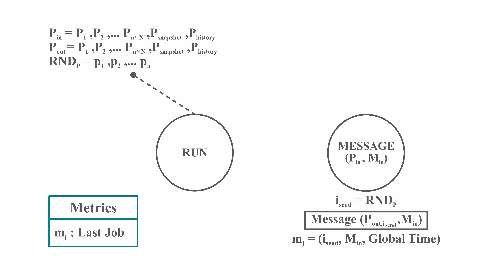
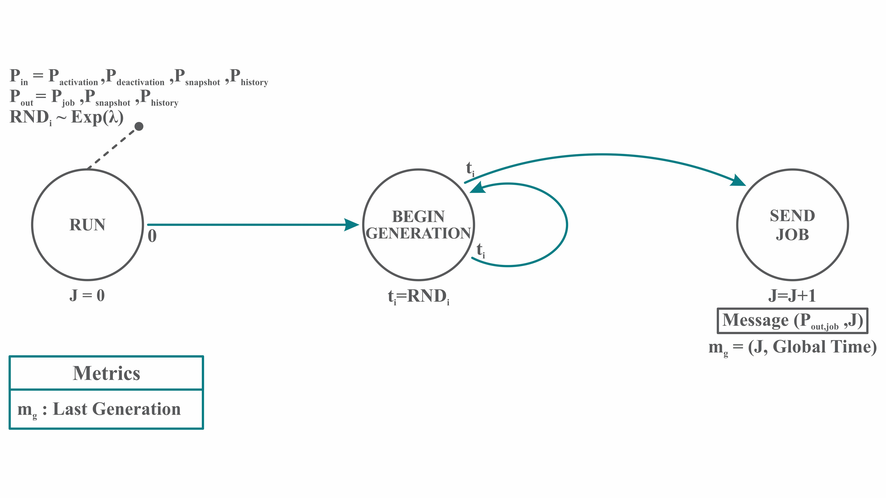
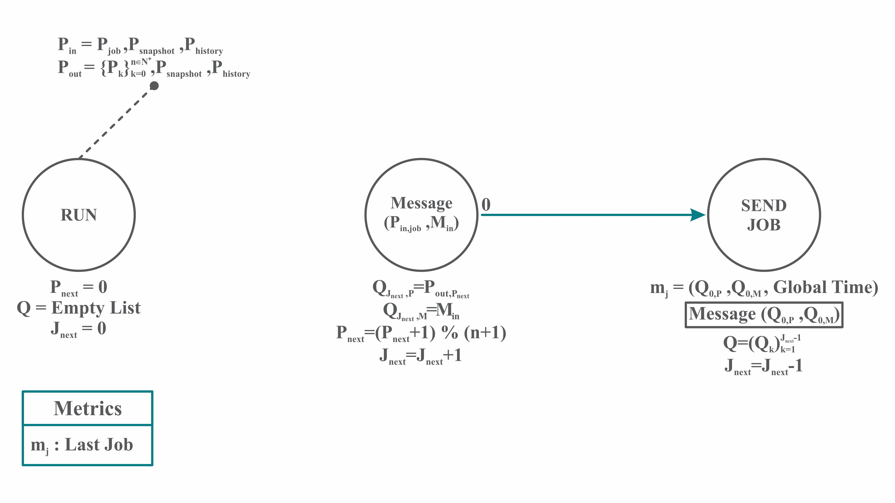
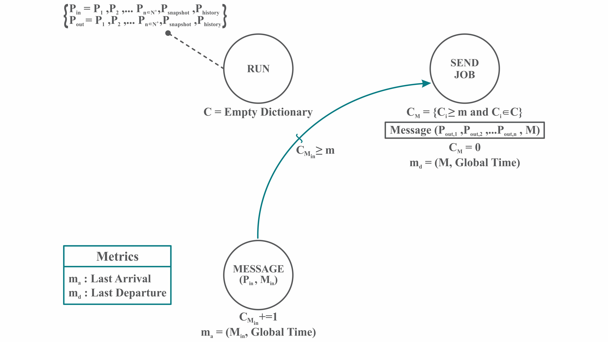
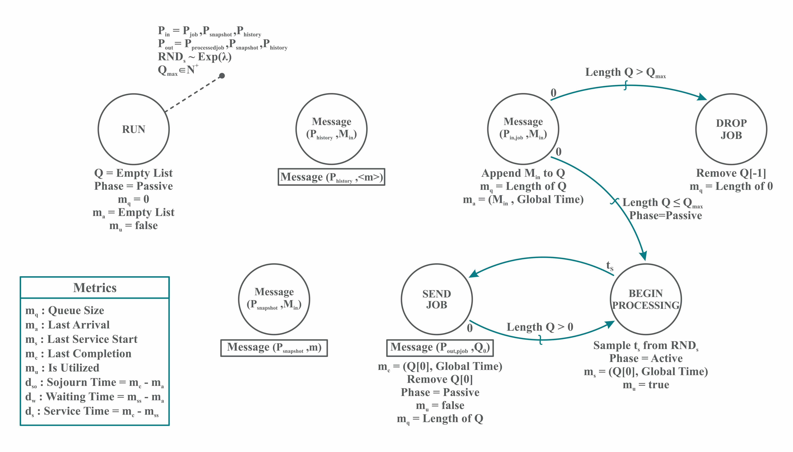
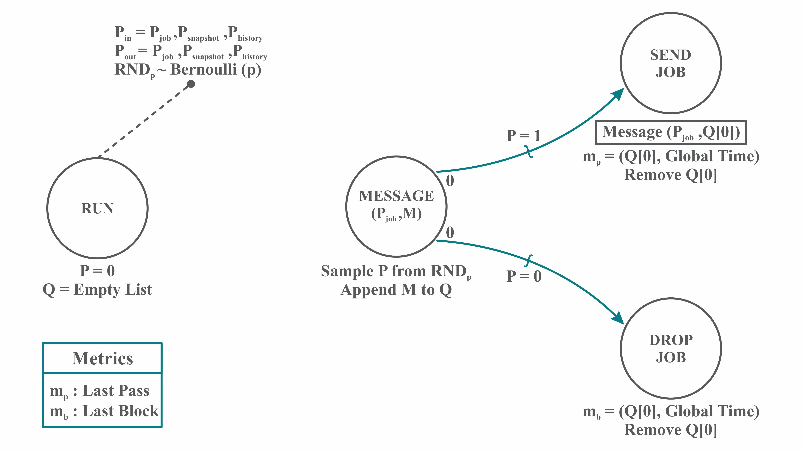
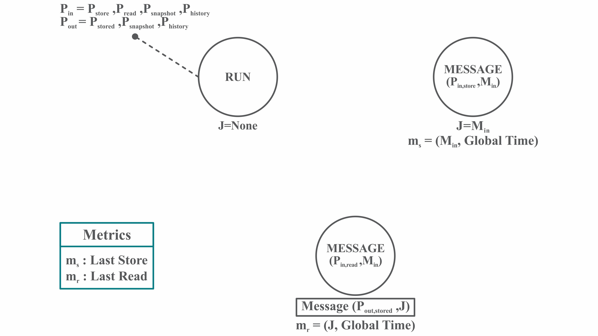

# Sim Atomic Models

## Exclusive Gateway

The exclusive gateway splits a process flow into a set of possible paths.  The process will only follow one of the possible paths.  Path selection is determined by Weighted Index distribution random variates, so this atomic model exhibits stochastic behavior.  The exclusive gateway is a BPMN concept.

_Example: 25% of jobs must undergo additional processing, while 75% do not.  The main process path is split by an exclusive gateway, into the two possible paths of "additional processing" and "no additional processing".  The 25%:75% weighting of possible paths is specified in the model configuration._

## Gate

The gate model passes or blocks jobs, when it is in the open or closed state, respectively.  The gate can be opened and closed throughout the course of a simulation.  This model contains no stochastic behavior - job passing/blocking is based purely on the state of the model at that time in the simulation.  A blocked job is a dropped job - it is not stored, queued, or redirected.

_Example: During a blackout period, jobs are dropped instead of proceeding through the usual processing path.  The simulation is configured such that a gate model is closed during blackout periods and opened after blackout periods.  Jobs arriving at the gate during the blackout will be dropped, and jobs arriving outside a blackout period will be passed._

## Generator

The generator produces jobs based on a configured interarrival distribution.  A normalized thinning function is used to enable non-stationary job generation.  For non-stochastic generation of jobs, a random variable distribution with a single point can be used - in which case, the time between job generation is constant.  This model will produce jobs through perpetuity, and the generator does not receive messages or otherwise change behavior throughout a simulation (except through the thinning function).

_Example: New customer requests are modeled as a generator, with a thinning function to account for seasonality and request interarrival variation throughout each day.  The generator model is at the start of the business process for processing the customer request._

## Load Balancer

The load balancer routes jobs to a set of possible process paths, using a round robin strategy.  There is no stochastic behavior in this model.

_Example: There are three identical processing paths for new jobs, and a simple routing strategy is employed - splitting the incoming jobs evenly across the paths.  The load balancer at the start of the three processing paths will first send a job down the first path, then the next job to the second path, then the next job to the third path, and will loop back to the first path for routing the next job._

## Parallel Gateway

The parallel gateway splits a job across multiple processing paths.  The job is duplicated across every one of the processing paths.  In addition to splitting the process, a second parallel gateway can be used to join the split paths.  The parallel gateway is a BPMN concept.

_Example: Every customer request is processed using two different end-to-end business processes, to evaluate the performance of a new, candidate process against the old established process.  A parallel gateway splits the incoming customer request - duplicating it across the two business processes._

## Processor

The processor accepts jobs, processes them for a period of time, and then outputs a processed job.  The processor can have a configurable queue, of size 0 to infinity, inclusive.  The default queue size is infinite.  The queue allows collection of jobs as other jobs are processed.  A FIFO strategy is employed for the processing of incoming jobs.  A random variable distribution dictates the amount of time required to process a job.  For non-stochastic behavior, a random variable distribution with a single point can be used - in which case, every job takes exactly the specified amount of time to process.  

_Example: When receiving a customer request by email, team members must enter that request into the ERP system, and provide additional metadata.  The time between arrival of the customer request and submission of the ERP record is estimated with a Triangular distribution._ 

## Stochastic Gate

The stochastic gate blocks (drops) or passes jobs, based on a specified Bernoulli distribution.  If the Bernoulli random variate is a 0, the job will be dropped.  If the Bernoulli random variate is a 1, the job will be passed.

_Example: A processing step has a 0.5% chance of breaking the job - requiring scraping.  The stochastic gate model follows a processor model in the simulation.  Together, these models simulate the processing step - a step which takes time and fails with a given probability.  

## Storage

The storage model stores a value, and responds with it upon request.  Values are stored and value requests are handled instantantaneously.

_Example: As a part of a Customer of the Month initiative, one customer every month will get additional management interaction and free customer success consulting for all of their requests.  The storage model stores the value of the current customer of the month.  Where customer request processing differs for regular customers vs. the customer of the month, models will understand the required processing path by getting the current customer of the month value from the storage model._

