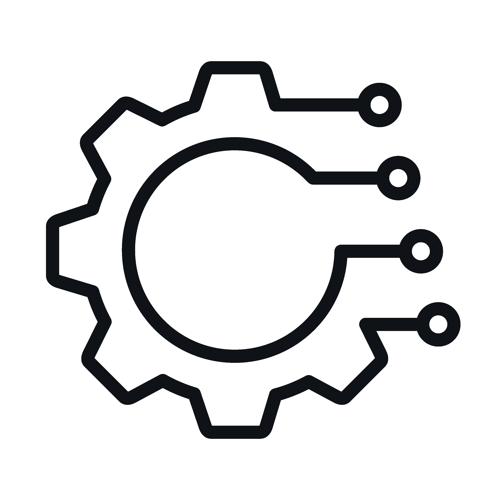

<div align="center">
	
	<h1>Sim</h1>
  <p>"Sim" or "SimRS" is a discrete event simulation package that facilitates<br>Rust- and npm-based simulation products and projects</p>
  <p><a href="https://simrs.com">Sim Website</a> | <a href="https://simrs.com/demo/">Sim Demo</a> | <a href="https://docs.rs/sim/">Sim Docs</p>
  <br>
</div>


[](https://github.com/ndebuhr/sim/actions)
[](https://crates.io/crates/sim)

[](https://www.npmjs.com/package/sim-rs)

[](https://docs.rs/sim/)
[](https://codecov.io/gh/ndebuhr/sim)
[](#license)

"Sim" or "SimRS" is a discrete event simulation package that facilitates Rust- and npm-based simulation products and projects.

This repository contains:

1. [Random variable framework](src/input_modeling), for easy specification of stochastic model behaviors.
2. [Pre-built atomic models](src/models), for quickly building out simulations of dynamic systems with common modular components.
3. [Output analysis framework](src/output_analysis), for analyzing simulation outputs statistically.
4. [Simulator engine](src/simulator), for managing and executing discrete event simulations.

Sim is compatible with a wide variety of compilation targets, including WebAssembly.  Sim does not require nightly Rust.

## Table of Contents

- [Background](#background)
- [Install](#install)
- [Usage](#usage)
- [Contributing](#contributing)
- [License](#license)

## Background

Simulation is a powerful tool for analyzing and designing complex systems.  However, most simulators have steep learning curves, are proprietary, and suffer from limited portability.  Sim aspires to reduce the time required to build new simulation products, complete simulation projects, and learn simulation fundamentals.  Sim is open source and, by virtue of compilation target flexibility, relatively portable.

## Install

For use in Rust code bases, leverage the package as a `cargo` dependency

```toml
[dependencies]
sim = "0.4"
```

For use as a WebAssembly module in a JavaScript/TypeScript code base, leverage the package as a `npm` dependency

```bash
npm i sim-rs
```

## Usage

Please refer to the documentation at [https://docs.rs/sim](https://docs.rs/sim)

Also, the [test simulations](src/simulator/test_simulations.rs) are a good reference for creating, running, and analyzing simulations with Sim.

### Creating Simulations
Simulation definitions are defined in a declarative YAML or JSON format, and then ingested through `Simulation`'s `post_yaml` or `post_json` constructors.

Both models and connectors are required to define the simulation.  For descriptions of the pre-built models, see [MODELS.md](MODELS.md) A simple three-model simulation could be defined as:

Nodes:
```yaml
- type: "Generator"
  id: "generator-01"
  portsIn: {}
  portsOut:
    job: "job"
  messageInterdepartureTime:
    exp:
      lambda: 0.5
- type: "Processor"
  id: "processor-01"
  portsIn:
    job: "job"
  portsOut:
    processedJob: "processed"
  serviceTime:
    exp:
      lambda: 0.333333
  queueCapacity: 14
- type: "Storage"
  id: "storage-01"
  portsIn:
    store: "store"
    read: "read"
  portsOut:
    stored: "stored"
```

Connectors:
```yaml
- id: "connector-01"
  sourceID: "generator-01"
  targetID: "processor-01"
  sourcePort: "job"
  targetPort: "job"
- id: "connector-02"
  sourceID: "processor-01"
  targetID: "storage-01"
  sourcePort: "processed"
  targetPort: "store"
```

### Running Simulations
Simulations may be stepped with the `step`, `step_n`, and `step_until` methods.  Input injection is possible with the `inject_input` method.

### Analyzing Simulations
Analyzing simulations will typically involve some combination of listening to model metrics, collecting message transfers, and using output analysis tools.  Analysis of IID samples and time series data are possible.

## Contributing

Issues, feature requests and pull requests are always welcome!

## License

This project is licensed under either of [Apache License, Version 2.0](https://www.apache.org/licenses/LICENSE-2.0) or [MIT License](https://opensource.org/licenses/MIT) at your option.

[Apache License, Version 2.0](LICENSE-APACHE)

[MIT License](LICENSE-MIT)

Unless you explicitly state otherwise, any contribution intentionally submitted for inclusion in sim by you, as defined in the Apache-2.0 license, shall be dual licensed as above, without any additional terms or conditions.